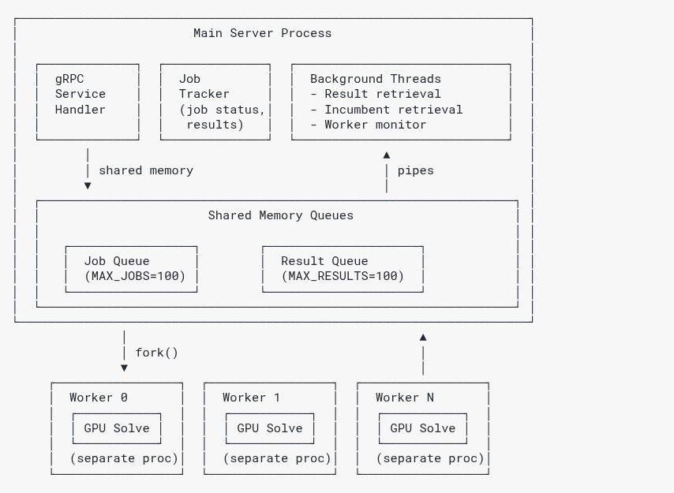
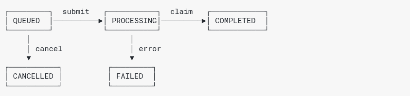

# gRPC Server Behavior

NVIDIA cuOpt's **`cuopt_grpc_server`** uses one **main process** (gRPC front end, job tracking, background threads) and **worker processes** that run GPU solves. That layout gives isolation between jobs, optional parallelism when you set multiple workers, and streaming for large problems and logs.

Implementation details (IPC layout, C++ source map, chunked transfer internals) live in the contributor reference: **`cpp/docs/grpc-server-architecture.md`** in the NVIDIA cuOpt repository.

## Process Model

## Job Lifecycle (Summary)

**Submit** → the server assigns a job id and queues work. **Process** → a worker pulls the problem, solves on the GPU, and streams the result back. **Retrieve** → the client uses status and result RPCs (including chunked download when needed). See [gRPC API (reference)](api.rst) for RPC names.

## Job States

## Logs, Capacity, and Workers

| Topic | Detail |
|-------|--------|
| Log files | Per-job solver logs under `/tmp/cuopt_logs/job_<job_id>.log` (used by log streaming). |
| Capacity | Up to **100** in-flight jobs (queued + processing). Completed results stay until `DeleteResult` (no fixed result cap). |
| Workers | Recommended: **1 worker process per GPU**. Higher values are possible depending on the problems being solved but there is no specific guidance at this time. |

## Fault Tolerance and Cancellation

- If a **worker process crashes**, jobs it was running are marked **FAILED**; the server can spawn replacement workers (see contributor doc for details).
- **`CancelJob`** cancels **queued** jobs immediately (the worker skips them). If the solver has already started, the **worker process is killed** and the job is marked **CANCELLED**; a replacement worker is spawned automatically.
- **Ctrl-C / SIGTERM** cancels active jobs, kills worker processes, and shuts the server down without waiting for an in-flight solve to finish.
- **`DeleteResult`** also cancels a queued or running job (same kill/skip behavior as ``CancelJob``), then removes all server-side state for that ``job_id``.

## Further Reading

- [Advanced configuration](advanced.rst) — `cuopt_grpc_server` **command-line flags**, TLS, Docker (`CUOPT_SERVER_TYPE`, `CUOPT_GRPC_ARGS`), and **client** environment variables (authoritative for operators).
- [gRPC API (reference)](api.rst) — `CuOptRemoteService` RPC overview.
- **Contributor reference** — `cpp/docs/grpc-server-architecture.md` in the repository (IPC, source files, streaming, threading).
